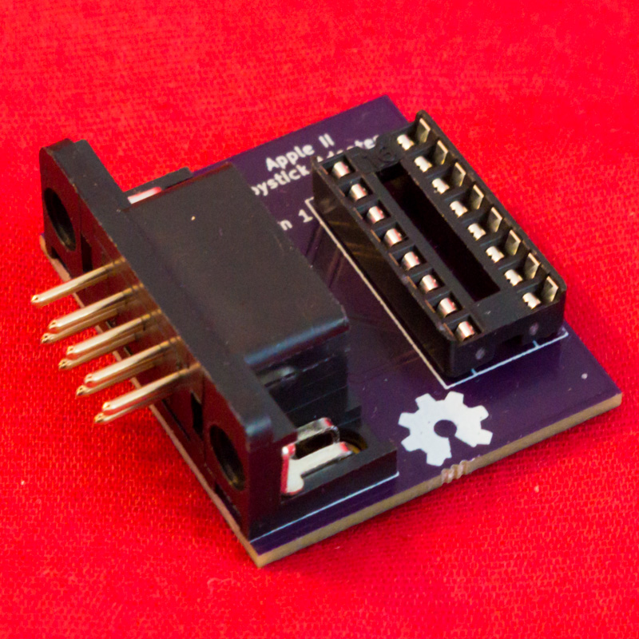
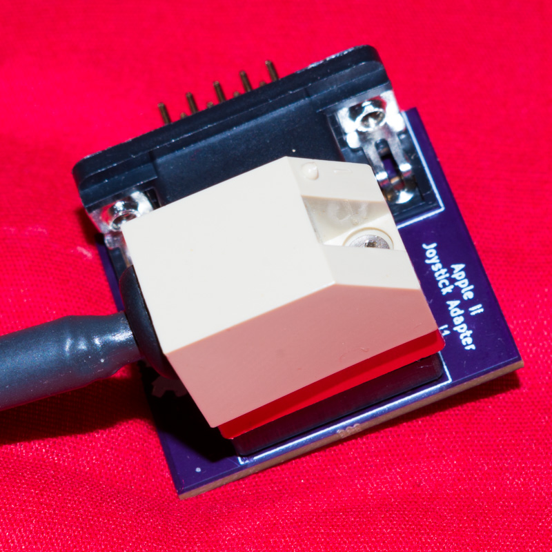
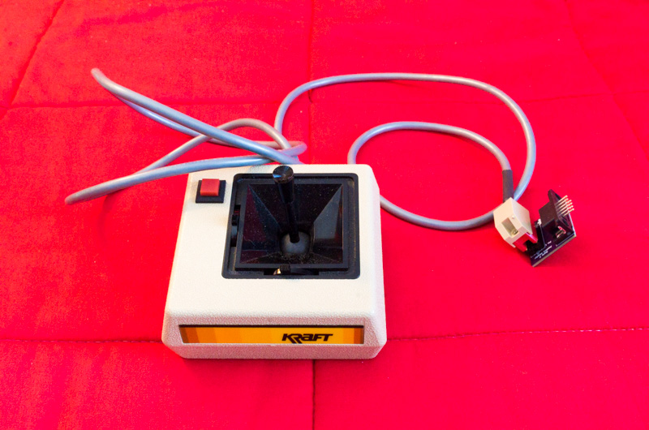

# Apple II Joystick Adapter

This small board lets you plug a 16-pin joystick into the external
9-pin joystick port on the Apple IIe.  Although the Apple IIe has an
internal 16-pin joystick port, I found that the connector on my
joystick was too big to fit through any of the holes on the back of
the IIe.  So, I created this adapter to let me plug it in externally.

This adapter could also be useful for the Apple IIc, which does not
have a 16-pin joystick port at all, although I have not tested it on a
IIc.

* [View schematic](doc/schematic.pdf)
* [View PCB][41]

## Bill of Materials

* [Right-angle male DE-9 connector][1]
* [16-pin DIP socket][2]

I found it necessary to remove the hex screws from the DE-9 connector,
because they prevented it from mating with the connector on the Apple
IIe.

## Ordering the Board

You can order this board [directly from OSH Park][40] without needing
to upload anything.

If you want to modify the design, the source is provided in
[KiCad][83] format.

## License

This project is licensed under [CC-BY-SA 4.0][10].

The symbol and footprint for the DE-9 connector are from
[the official KiCad 5 library][8] ([CC-BY-SA 4.0 with exception][9]).

[1]: https://www.digikey.com/product-detail/en/assmann-wsw-components/A-DS-09-A-KG-T2S/AE10968-ND/1241804
[2]: https://www.digikey.com/product-detail/en/assmann-wsw-components/A-16-LC-TT/AE9992-ND/821746
[8]: https://github.com/KiCad/kicad-symbols/blob/master/Connector.lib
[9]: https://forum.kicad.info/t/kicad-library-licensing/7856
[10]: https://creativecommons.org/licenses/by-sa/4.0/legalcode
[40]: https://oshpark.com/shared_projects/WuNA7JH0
[41]: https://eyrie.io/board/068ea680987149dfb0afcb60a86e0048
[83]: http://kicad.org/
